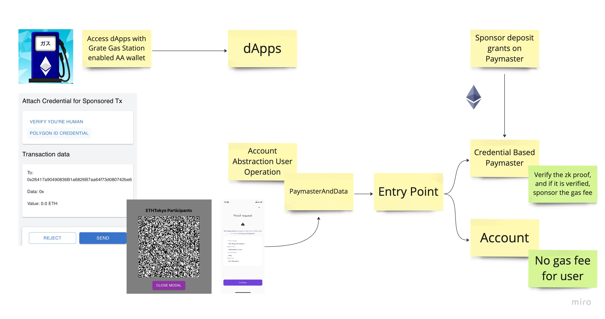

# Grate Gas Grants

Great Gas Grants is an innovative, credential-based gas grants service that harnesses the power of the Account Abstraction Paymaster to provide users with access to gas grants tailored to their credentials.

## Description

Great Gas Grants offers an innovative solution for funding gas fees, powered by our new Account Abstraction Paymaster with credential-based verification. Now, it's easier than ever for community members to join the Web3 ecosystem.

Key Features:

- Smooth Web3 Onboarding
- Access to Learning Resources
- Community Empowerment
- Developer Grant Opportunities

Our platform is Sybil attack-resistant and utilizes the Account Abstraction Paymaster for credential-based verification. Seamlessly integrating with services like Polygon ID and Worldcoin, it provides granting and verification processes that respect user privacy while ensuring the use of valid credentials.

## How it works

### ERC4337 smart contract and bundler
The platform utilizes the ERC4337 0.5.0 smart contract standard and bundler for efficient transaction processing. To jumpstart the development of the wallet app, Grate Gas Grants leveraged Trampolin, a popular quick-start solution.

### Polygon ID and Worldcoin for credential services
Grate Gas Grants integrates Polygon ID and Worldcoin as credential services to verify user eligibility. While Polygon ID provides general credential verification, Worldcoin offers human-proof verification. Both services are privacy-preserving, ensuring user data remains secure.  

### Custom Account Abstraction Paymaster smart contract
The platform employs a custom Account Abstraction Paymaster smart contract to verify user credentials on-chain. Once credentials are verified, the smart contract sponsors the transaction, allowing only eligible users to benefit from the gas grants.
